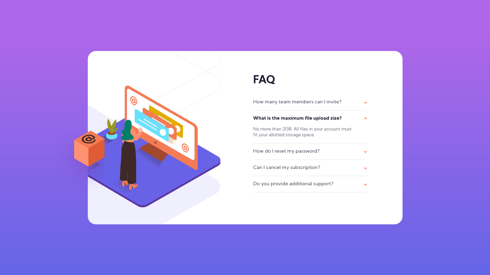

# Frontend Mentor - FAQ accordion card solution

This is a solution to the [FAQ accordion card challenge on Frontend Mentor](https://www.frontendmentor.io/challenges/faq-accordion-card-XlyjD0Oam). Frontend Mentor challenges help you improve your coding skills by building realistic projects. 

## Table of contents

- [Overview](#overview)
  - [The challenge](#the-challenge)
  - [Screenshot](#screenshot)
  - [Links](#links)
- [My process](#my-process)
  - [Built with](#built-with)
  - [Thoughts](#thoughts)
- [Author](#author)

## Overview

### The challenge

Users should be able to:

- View the optimal layout for the component depending on their device's screen size
- See hover states for all interactive elements on the page
- Hide/Show the answer to a question when the question is clicked

### Screenshot

### Links

[Solution URL](https://faq-accordion-card-fem.netlify.app/)

## My process

### Built with

- Semantic HTML5 markup
- CSS custom properties
- Flexbox
- CSS Grid
- Javascript
- Mobile-first workflow

### Thoughts

For each question this solution uses an article element with a button and some pragraphs inside. For now, I leave it as it is, but I found some HTML elements that might be more suitable for creating a [disclosure widget](https://developer.mozilla.org/en-US/docs/Web/HTML/Element/details). Apart from IE, most browsers seem to support the details element and it looks fine from the [accessibility point of view](https://www.scottohara.me/blog/2018/09/03/details-and-summary.html).

I may update this solution in the future, until then, this element is an interesting thing to note, at least.

## Author

- Frontend Mentor - [@FluffyKas](https://www.frontendmentor.io/profile/FluffyKas)
